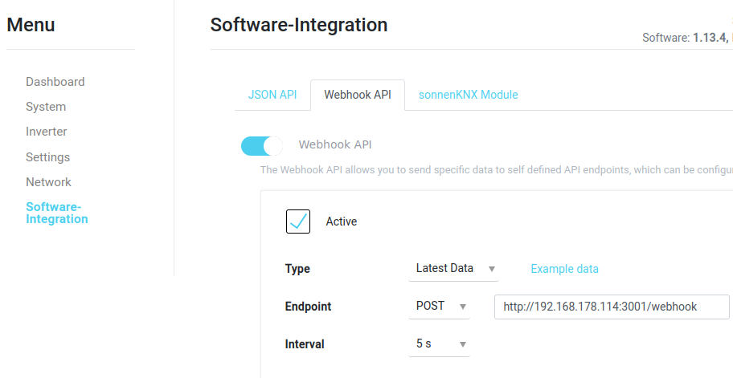

# Description
Simple webhook server that receives json updates and forwards it to a MQTT broker.

## Use case: Publish SonnenBatterie Status by Webhook API
Prepare sonnenBatterie Webhook API from the local web interface. (Check local IP address of your installed sonnenBatterie). To login use type "Users" and your password to sonnen portal. To connect to your deployed webhook server add the address and port (default 3001) as server entry. Take following example picture as template for a webhook API configuration.



# Prerequisites

## MQTT Broker
Prepare a MQTT broker instance accessible for the webhook server. Example: Mosquitto from docker hub (https://hub.docker.com/_/eclipse-mosquitto)

# Get Started
In index.js replace "\<MQTT SERVER\>" and "\<MQTT Topic\>" with your actual MQTT broker address and topic.

## Local Run

```bash
npm install
npm run
```

## Docker Deployment

Build docker image and run container with portmapping. Internal port is 3001.
```bash
docker build -t sonnenbatterie-webhook .
docker run -p 3001:3001 sonnenbatterie-webhook
```
